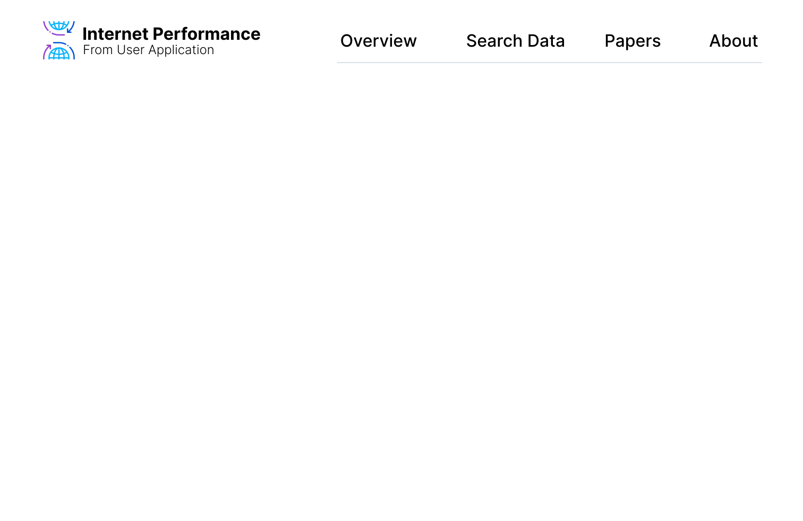
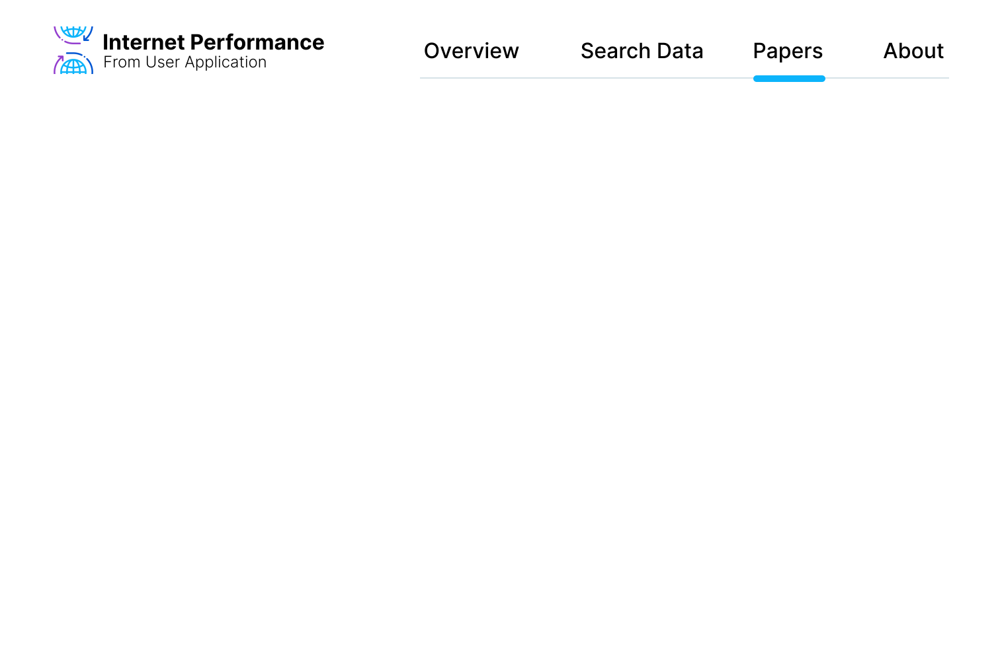

# App Design

In order to have a clear idea of the frontend design, here you can find the main features of the app as well as the style guide for the CSS.

For detailed guidelines about the design of the web app, you can find [here](https://www.figma.com/file/dw9atzxHUTL7LCi7pvZbfk/Internet-Performance?node-id=0%3A1&t=FHvAOG1furo4LWgo-1) the Figma mock up of the app. In case you want to modify it, you can contact [Ugo Balduci](mailto:ugo.balducci@epfl.ch) to get access to the project Figma.

## Overview

Apart from the home screen, the app is divided into 4 main sections :

- **Overview** : an overview of the performance recorded per country.
- **Search Data** : a screen to select data from the dataset and generate diagrams.
- **Papers** : a list of the papers from the study.
- **About** : the screen where the user can find information about the app and the legal information.

### Home Screen

 
{: .flex-justify-between}

### Overview

 
{: .flex-justify-between}

### Search Data

 
{: .flex-justify-between}

 
{: .flex-justify-between}

 
{: .flex-justify-between}

 
{: .flex-justify-between}

### Papers

 
{: .flex-justify-between}

### About

 
{: .flex-justify-between}

## Style Guide